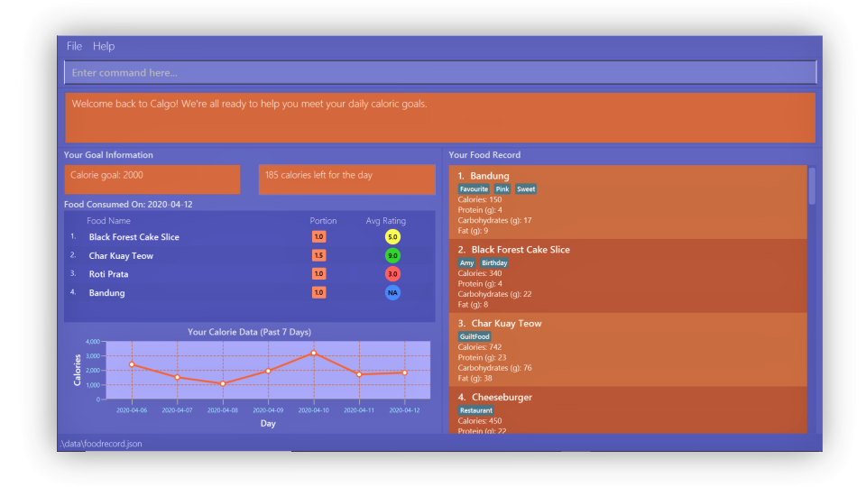

= Calgo
ifdef::env-github,env-browser[:relfileprefix: docs/]

https://travis-ci.org/AY1920S2-CS2103T-F11-1/main[image:https://api.travis-ci.org/AY1920S2-CS2103T-F11-1/main.svg?branch=master[Build Status]]

ifdef::env-github[]

endif::[]

ifndef::env-github[]
image::images/Ui.png[width="600"]
endif::[]

Can you remember what you had 2 days ago, for lunch? How about last week? +

You already know how important a consistent diet is in shaping your fitness.
In spite of its importance, not everybody is tracking their meals. Why?
It is just too inconvenient and time-taking. You already have so many things to do and keeping track of what you
eat simply could not fit into your schedule. But, now it can.

Introducing *Calgo*, your personal meal-tracking assistant:

* Change the way you approach fitness: Calgo offers an all-in-one calorie tracker that is easy-to-use and guaranteed to save you from the frustrations of meal tracking. Bye bye complexity!
* Calgo's comprehensive reports also transform the way you approach your daily meals through intelligent suggestions on how to improve your meal consumption patterns.
* A lot of careful thought has been put in when designing Calgo to ensure that you have a smooth experience and won't end up spending too much time in learning how it works. Save that time for other important stuff.
* To evolve with the times and help you calculate your calories in a fraction of a second, Calgo is fully digital. It is a gift of convenience to you, packaged as a beautiful desktop application. I mean just look at our User Interface above. As the saying goes, pictures speak a thousand words but pictures of your consumption data saves you thousands of excess calories!
* Excited and want to know how to start making calories go? Download Calgo now from our latest GitHub release!

== Site Map

* If you need help in setting up and learning about Calgo's features, check out our <<UserGuide#, User Guide>>.
* If you are a developer wanting to contribute and learn how Calgo works, check out our <<DeveloperGuide#, Developer Guide>>.
* To learn about the team working to make your Calgo experience effortless, read <<AboutUs#, About Us>>.
* If you need anything else, <<ContactUs#, Contact Us>>.

== Acknowledgements

* Some parts of this application were inspired by the excellent http://code.makery.ch/library/javafx-8-tutorial/[Java FX tutorial] by
_Marco Jakob_.
* Calgo is adapted from the AddressBook-Level3 project created by the https://se-education.org[SE-EDU initiative].
* Libraries used: https://openjfx.io/[JavaFX], https://github.com/FasterXML/jackson[Jackson], https://github.com/junit-team/junit5[JUnit5].

== Licence : link:LICENSE[MIT]
